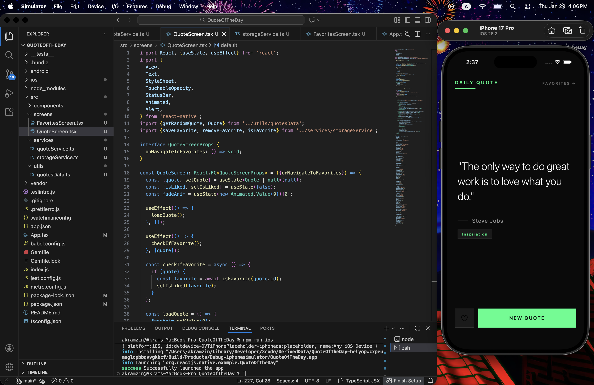
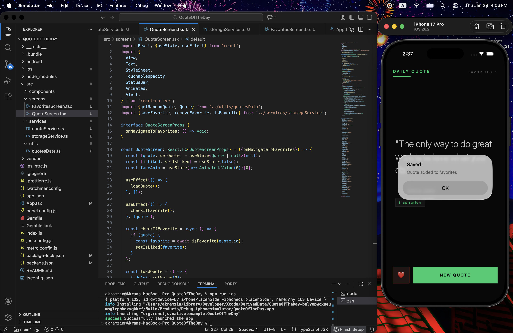
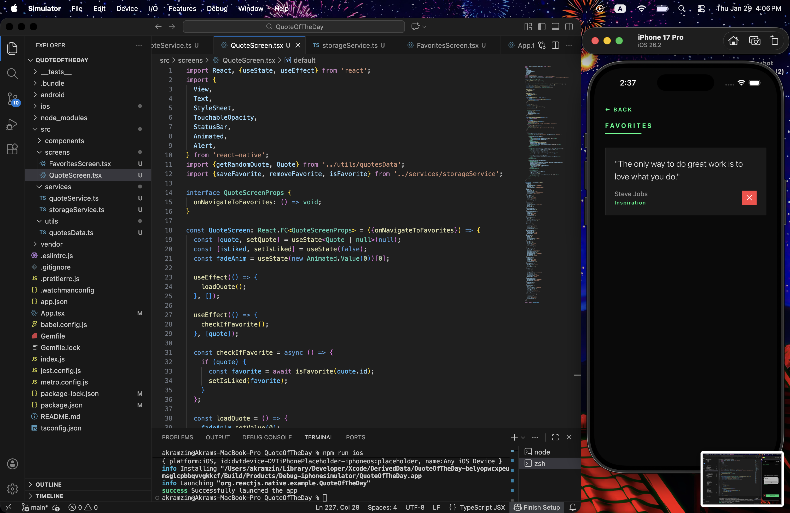
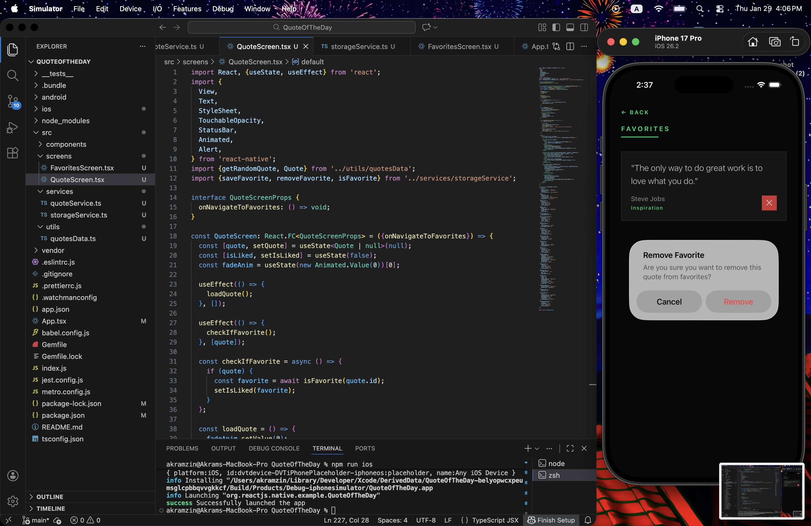

# 📱 Quote of the Day - React Native App

A minimalist quote application built with React Native featuring a Gen Z aesthetic with dark mode and neon green accents.

## ✨ Features

- 🎲 **Random Quotes** - Get inspiring quotes with smooth fade animations
- ❤️ **Favorites** - Save your favorite quotes locally
- 📂 **Favorites Management** - View and manage all saved quotes
- 💾 **Persistent Storage** - Uses AsyncStorage for local data persistence
- 🎨 **Gen Z Minimalist UI** - Clean black background with neon green accents
- 🏷️ **Category Tags** - Each quote is tagged with its category
- ✨ **Smooth Animations** - Elegant fade-in effects on quote changes

## 📸 Screenshots

### Main Screen


### Favorite a Quote


### Favorites List


### Remove from Favorites


## 🛠️ Tech Stack

- **React Native** (without Expo)
- **TypeScript**
- **AsyncStorage** - Local data persistence
- **React Hooks** - State management
- **Animated API** - Smooth transitions

## 📦 Installation

### Prerequisites
- Node.js
- React Native CLI
- Xcode (for iOS)
- CocoaPods

### Setup

1. Clone the repository:
```bash
git clone https://github.com/akramzin/QuoteOfTheDay-ReactNative.git
cd QuoteOfTheDay-ReactNative
```

2. Install dependencies:
```bash
npm install
```

3. Install iOS dependencies:
```bash
cd ios
pod install
cd ..
```

4. Run the app:

**iOS:**
```bash
npm run ios
```

**Android:**
```bash
npm run android
```

## 📁 Project Structure
```
QuoteOfTheDay/
├── src/
│   ├── screens/
│   │   ├── QuoteScreen.tsx      # Main quote display screen
│   │   └── FavoritesScreen.tsx  # Favorites list screen
│   ├── services/
│   │   ├── quoteService.ts      # API service (placeholder)
│   │   └── storageService.ts    # AsyncStorage operations
│   ├── utils/
│   │   └── quotesData.ts        # Local quotes database
│   └── components/              # Reusable components (future)
├── App.tsx                       # Main app component with navigation
└── README.md
```

## 🎨 Design Philosophy

This app follows a **Gen Z minimalist aesthetic**:
- **Color Palette**: Pure black (#0a0a0a) with neon green (#00ff88) accents
- **Typography**: Clean, modern fonts with varied weights
- **Layout**: Generous whitespace, sharp edges (no rounded corners)
- **Animations**: Subtle fade-ins for a polished feel

## 🚀 Features Breakdown

### Quote Display
- Displays random quotes from a curated database
- Shows author name with decorative line
- Category badge for each quote
- Smooth fade-in animation on load

### Favorites System
- Heart button to save/unsave quotes
- Persistent storage using AsyncStorage
- Visual feedback with alerts
- Dedicated favorites screen

### Navigation
- Simple state-based navigation between screens
- Back button on favorites screen
- Clean transitions

## 📝 Future Enhancements

- [ ] Share quotes to social media
- [ ] Daily notification with quote
- [ ] Search quotes by author or category
- [ ] Filter favorites by category
- [ ] Dark/Light theme toggle
- [ ] Add more quotes to database
- [ ] Widget for home screen

## 👨‍💻 Author

**Akramzin**
- GitHub: [@akramzin](https://github.com/akramzin)

## 📄 License

This project is open source and available under the MIT License.

## 🙏 Acknowledgments

- Quotes sourced from various inspirational authors
- Built as a learning project for React Native

---

Made with ❤️ and React Native